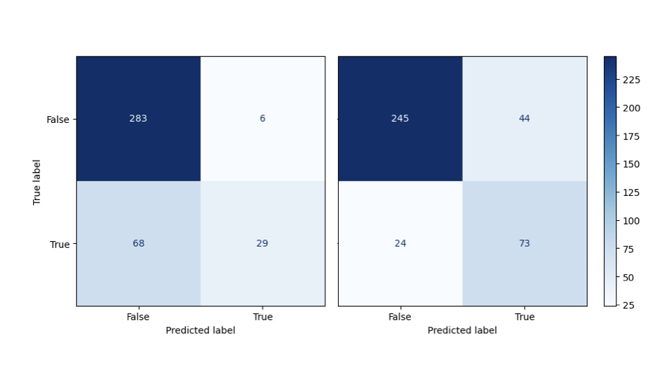
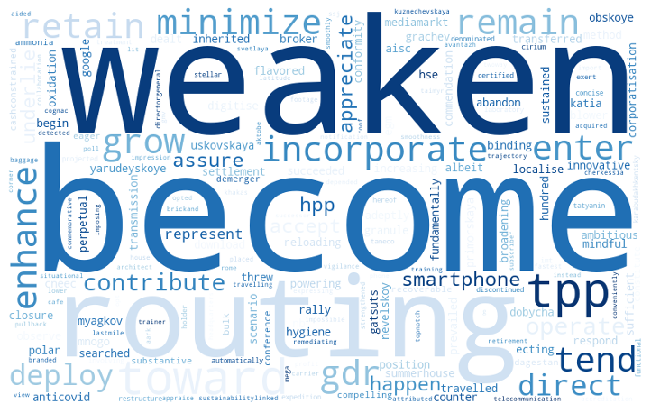

# project_fraud_nlp
Выявление корпоративного мошенничества с использованием NLP и ML (ВКР)

## Структура репозитория:
- папка _data_ содержит: _База данных.xlsx_ - файл с финансовыми показателями компаний и текстами годовых отчетов, _x_model1.csv_ - файл с рассчитанными переменными тональности, _LM_dict.xlsx_ - словарь Loughran & Mcdonald, на основе которого рассчитывались переменные тональности
- папка _models_ содержит файлы с разведочным анализом данных и построением моделей отдельно для каждого типа данных (финансовые показатели, векторизованные слова, переменные тональности), в файле _Модель с тональностью.ipynb_ представлен расчет переменных тональности
- файл _eda_модели_итог.ipynb_ содержит модели, построенные на всем наборе данных 

## О ВКР
_Тема: Выявление корпоративного мошенничества с использованием текстового анализа данных и методов машинного обучения: пример российских компаний_
- Краткое описание проделанной работы и полный текст можно найти здесь: https://www.hse.ru/edu/vkr/832509444
- Так как работа писалась как ВКР на факультете экономических наук, то в качестве данных были использованы тексты годовых отчетов российских компаний на английском языке, а также финансовые показатели из базы данных Cbonds
- В подобных зарубежных работах для анализа текста чаще всего использовался словарный подход (чаще всего с помощью словаря Loughran & Mcdonald), его было решено использовать и в этом проекте. Поэтому тексты на английском языке (словарь на англ.). Также в качестве новизны исследования было решено добавить векторизованные слова в модель и совместить упомянутые признаки с финансовыми показателями
- Выборка очень небольшая, так как на момент написания работы (2022-2023 гг.) компаниям было разрешено скрыть все прошлые годовые отчеты и не выкладывать новые. Тем более мало текстов годовых отчетов на английском языке

## Описание переменных:
_представлено также и в самой базе данных в кратком виде_  

### Финансовые показатели

**Переменные размера фирмы**
- итого активы (total assets - TA)
- выручка (revenue - R)
  
**Переменные рентабельности**
- Чистая прибыль (net income - NI)
- Чистая прибыль / Выручка (net income to revenues - NI/R)
- Операционная прибыль _рассчитывается как EBIT/выручка = (EBITDA - износ и амортизация) / выручка_ (operating margin - OM)
- Рентабельность капитала _рассчитывается как чистая прибыль / итого капитал_ (ROE - return on equity)
- Рентабельность активов _рассчитывается как чистая прибыль / итого активы_ (ROA - return on assets)

**Переменные активности фирмы**			
- рост неденежного чистого оборотного капитала (NCWC growth)					
- итого активы / выручка (total assets to revenues - TA/R)			
- денежные средства / выручка (cash to revenues - Cash/R)		
- неденежный чистый оборотный капитал / выручка (non-cash working capital to revenues - NCWC/R)

**Переменная структуры активов**	
- основные средства / итого активы (fixed assets to total assets - FA/TA)

**Переменная ликвидности**			
- неденежный чистый оборотный капитал (non-cash working capital - NCWC = current assets - current liabilities)

### Переменные тональности
_на основе Loughran и Mcdonald (2011):_
- общее количество слов,
- доля положительных, отрицательных, неопределенных, ограничительных, судебных, сильных модальных и слабых модальных слов,
- общий тон текста

_Коэффициенты сложности текста для прочтения и понимания, на основе работ Humpherys, Moffitt, Burns, Burgoon и Felix (2011) и Li (2008):_
- средняя длина предложения,
- доля сложных слов,
- Fog-index, равный 0,4 * (средняя длина предложения + доля сложных слов)

### Также использовался векторизованный с помощью tf-idf текст годовых отчетов 55 российских компаний на английском языке

### Целевая метрика - recall
Так как лучше ошибиться и посчитать, что мошенничество в компании есть (и провести в компании дополнительные проверки), чем не выявить его вообще

## Этапы проекта
- изучение литературы по теме и определение методологии
- сбор данных
- разведочный анализ данных (описательные статистики по переменным, построение графиков распределения и приведение их к нормальному виду, исключение сильно скоррелированных признаков)
- построение моделей машинного обучения, подбор гиперпараметров, выбор оптимальной модели

## Итоги:
_также можно найти в тексте дипломной работы в разделах введение и заключение_
- модель Random Forest в рамках этого проекта признана оптимальной: она смогла правильно предсказать корпоративное мошенничество в **75% случаев, что в 2,5 раза больше** того же показателя для логистической регрессии (на рисунке представлены матрицы ошибок для логистической регрессии и случайного леса соответственно)

- мошеннические тексты более сложны для понимания и прочтения
- по сравнению с мошенническими компаниями, для компаний, в которых не было мошенничества, тексты обращений руководства к акционерам будут содержать больше позитивных, меньше негативных слов и в целом будут более длинными
- были получены облака слов, сигнализирующих о наличии или отсутствии в компании мошенничества (на рисунках слева и справа соответственно)

 

### Ограничения работы:
- Возможна смещенность полученных оценок как из-за наличия в выборке только крупнейших компаний, так и из-за недоступности для ряда компаний годовых отчетов
- Возможно, не все случаи корпоративного мошенничества для представленной выборки были раскрыты на момент написания работы
- Тексты обращений руководства компании к акционерам написаны достаточно нейтрально, из-за чего словарный подход к определению их тональности может быть неэффективен, однако использование векторизованных слов позволяет компенсировать эту проблему
- Каждый язык имеет свои особенности, и текст одних и тех же годовых отчетов может иметь разный стиль написания на русском и английском языках (тексты годовых отчетов российских компаний лучше использовать на русском языке)

### Что можно улучшить в работе:
- Необходимо расширение выборки данных
- Возможно дальнейшее повышение качества предсказаний с помощью использования нейронных сетей
- Можно использовать не все векторизованные слова, а только наиболее значимые из них
- Возможно использование других источников текстовой информации (например, новостей)
- Можно расширить список используемых словарей тональности (попробовать словари на русском языке)

